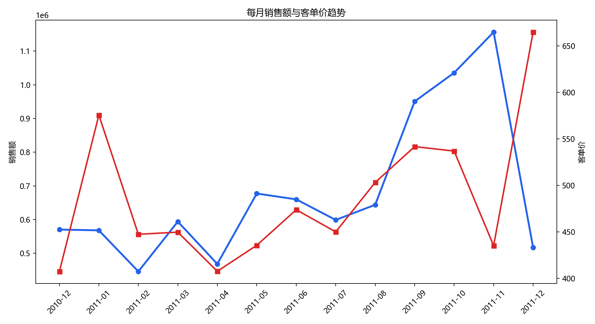
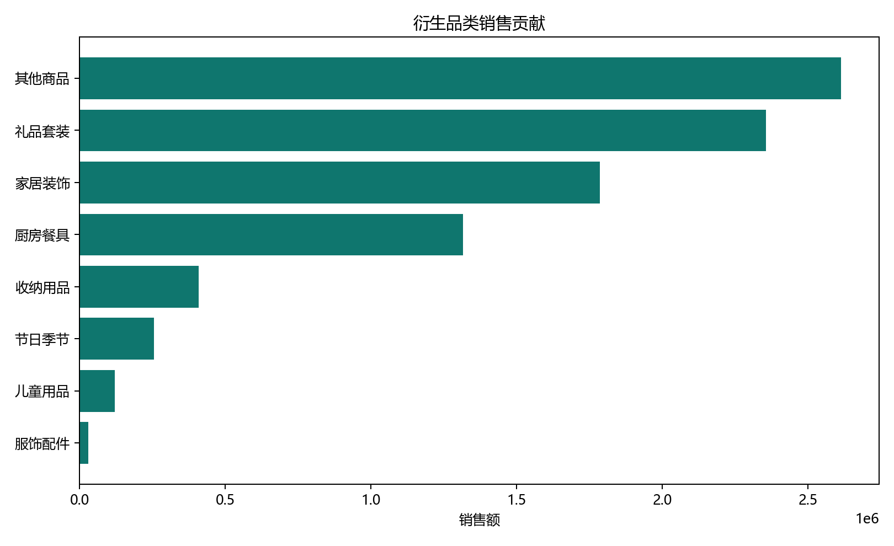
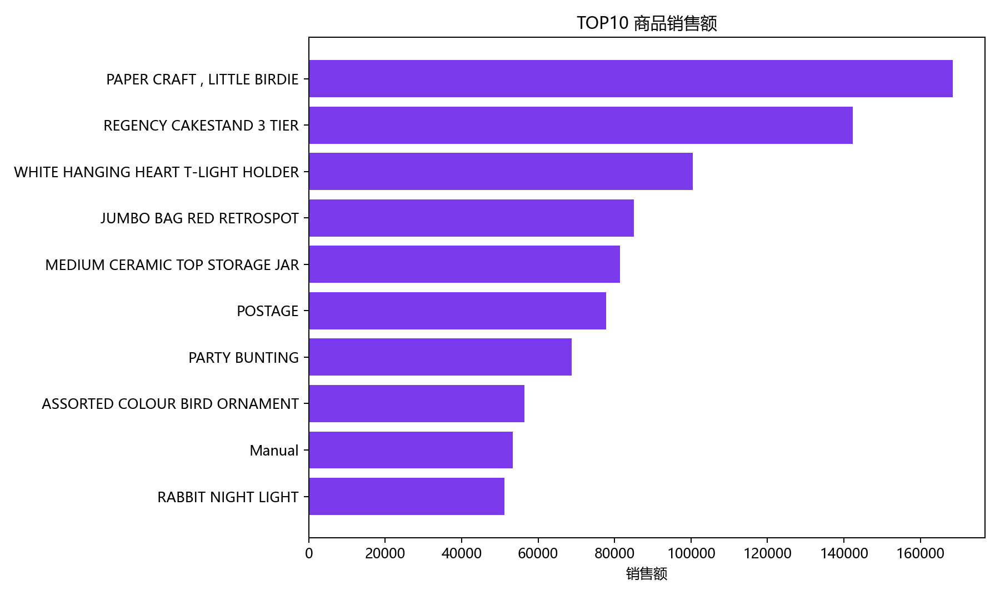
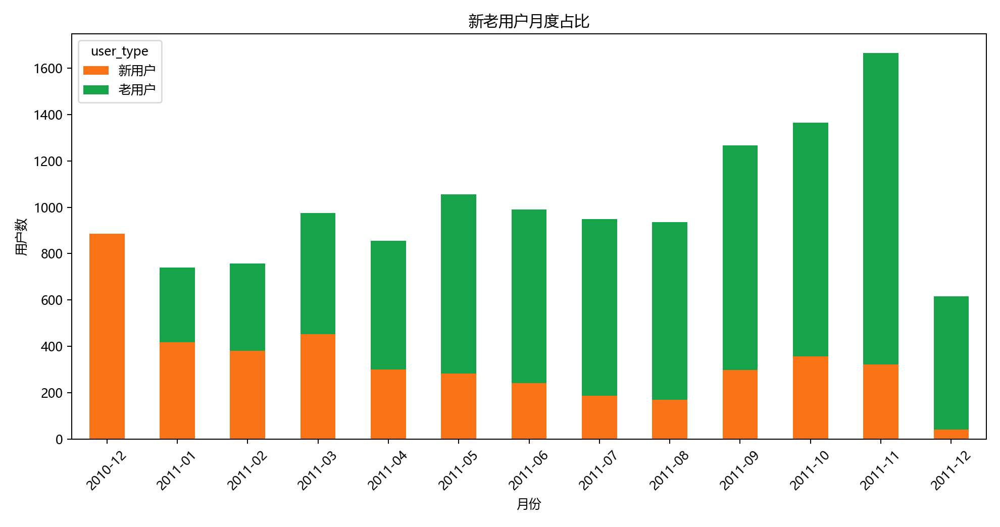
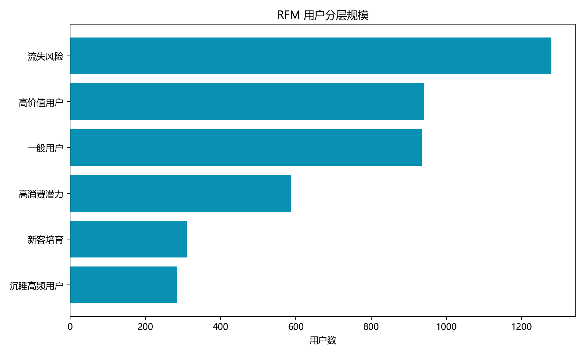
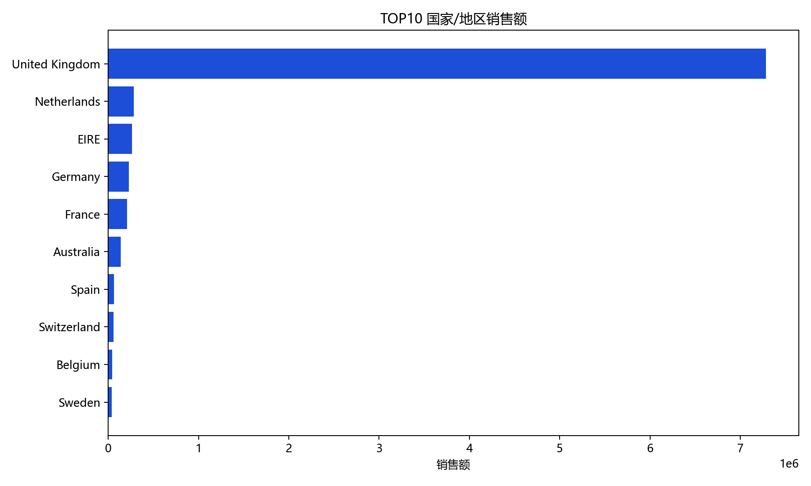
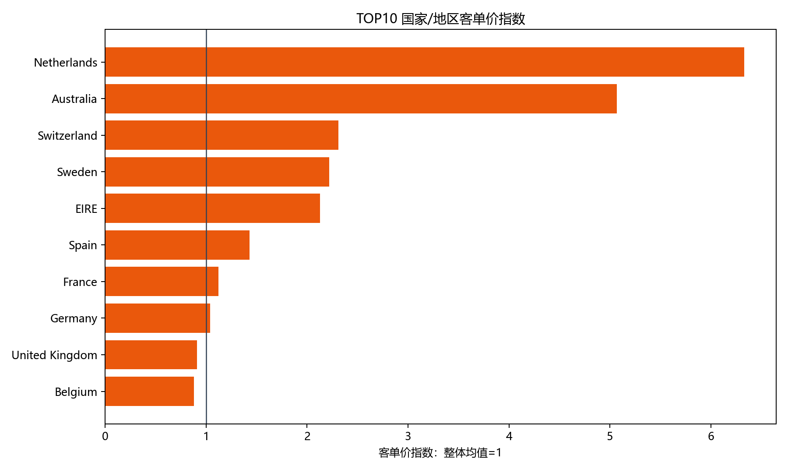

# 电商用户行为与销售数据分析报告

## 一、数据来源

本项目已替换为公开真实数据集：UCI Machine Learning Repository 的 **Online Retail** 数据集。该数据集记录了英国一家无实体店电商在 2010-12-01 至 2011-12-09 之间的真实交易流水，原始文件约 54.19 万行，字段包括订单号、商品编码、商品描述、数量、订单时间、单价、客户 ID 和国家/地区。

数据来源：https://archive.ics.uci.edu/dataset/352/online+retail

需要说明的是，原始数据不包含广告渠道、流量来源或转化漏斗字段。因此本报告不伪造渠道结论，渠道部分改为说明数据限制，并重点完成真实的国家/地区表现分析。

## 二、数据清洗

原始数据共有 541909 行记录。清洗过程中完成了以下处理：

- 统一订单时间字段为标准日期时间，并派生月份字段。
- 删除客户 ID、商品、日期、数量、单价等关键字段缺失的记录，保留 406829 行。
- 识别取消订单和退货记录：取消/退货相关行数为 9288 行。
- 删除重复明细行 5225 行。
- 过滤数量小于等于 0、单价小于等于 0 的记录，仅保留有效购买明细。
- 计算订单金额 `order_amount = quantity * unit_price`。
- 根据客户历史购买顺序计算复购标记 `is_repeat_order`。
- 基于商品描述关键词派生中文品类字段，用于品类贡献分析。

清洗后有效购买明细为 392692 行，覆盖 18532 个订单和 4338 位客户。

## 三、核心经营指标

- 总销售额：8,887,208.89 英镑
- 总订单量：18,532 单
- 有效用户数：4,338 人
- 客单价：479.56 英镑
- 复购率：65.58%
- 销售峰值月份：2011-11，销售额 1,156,205.61 英镑

销售峰值集中在 2011 年 11 月，符合礼品电商在圣诞季前备货和采购集中的业务规律。客单价与销售额并不完全同步，说明增长既受订单量影响，也受批发客户的大额采购影响。

## 四、销售分析

### 1. 每月销售额趋势

2011 年下半年销售额明显走高，11 月达到峰值。12 月数据只覆盖到 12 月 9 日，不能直接与完整月份比较。

### 2. 不同品类销售贡献

由于 UCI 原始数据没有标准品类字段，本项目根据商品描述派生了中文品类。销售贡献最高的衍生品类是 **其他商品**，销售额为 2,614,170.33 英镑，占比 29.41%。

### 3. TOP 商品分析

销售额最高的商品是 **PAPER CRAFT , LITTLE BIRDIE**，销售额为 168,469.60 英镑，销量 80995 件。TOP 商品往往体现平台主力商品池，应重点关注库存、补货和组合销售。

## 五、用户分析

### 1. 新老用户占比

新用户在早期月份占比较高，后续老用户贡献逐步上升，说明该电商存在较强复购和批发客户沉淀。

### 2. 用户复购率

当前复购率为 **65.58%**。对于礼品类和批发型电商，复购用户是稳定销售的重要来源。后续运营应重点维护高频和高消费客户。

### 3. RFM 用户分层

高价值用户共 942 人，平均消费 6091.24 英镑，平均购买 11.20 次。

高价值用户的特征是近期购买、购买频次高、累计消费高。建议为该群体配置提前补货提醒、批量采购折扣和重点客户服务。

## 六、国家/地区分析

### 1. 不同国家/地区销售额和订单量

销售额最高的国家/地区是 **United Kingdom**，销售额为 7,285,024.64 英镑；在订单量不少于 10 单的地区中，销售额较低的地区之一是 **Poland**，销售额为 7,334.65 英镑。

### 2. 表现差异较大的地区

客单价指数最高的国家/地区是 **Netherlands**，指数为 6.33。这说明部分地区虽然订单量不一定最大，但单笔订单价值更高，适合用更精细的客户维护和高价值商品推荐。

### 3. 渠道分析限制

该真实数据集没有渠道字段，因此不能真实回答“不同渠道转化效果”。如果业务方提供广告渠道、访问来源、点击、加购、支付等漏斗字段，可以继续补充渠道转化率、渠道 ROI、渠道客单价和渠道复购率分析。

## 七、业务建议

1. 重点备货和维护 TOP 商品，尤其在 9-11 月提前做库存计划，避免旺季缺货。
2. 对高价值客户建立 RFM 运营名单，配置批量采购折扣、提前购提醒和专属客服。
3. 对高客单价国家/地区优先推荐礼盒、套装和高毛利商品，提高单客价值。
4. 对低销售地区先排查物流成本、配送时效和本地需求，再决定是否扩大投放。
5. 品类字段目前为规则派生，后续若有真实商品类目，应替换规则分类以提高分析精度。
6. 渠道分析必须依赖真实渠道字段，不建议用随机渠道或人为分配渠道替代。

## 八、项目产出

- 清洗后数据：`data/processed/clean_orders.csv`
- 指标宽表：`data/processed/*.csv`
- matplotlib 图表：`reports/figures/*.png`
- Power BI 导入数据集：`reports/powerbi/powerbi_dashboard_dataset.xlsx`
- Power BI 搭建说明：`reports/powerbi/powerbi_dashboard_notes.md`
