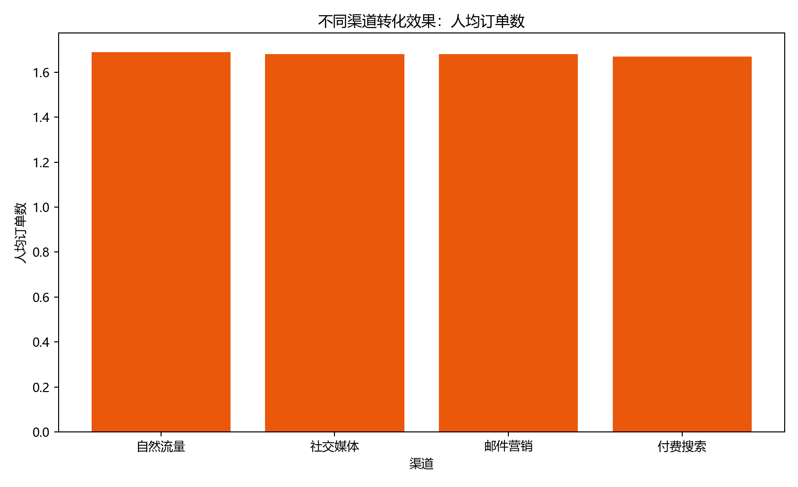
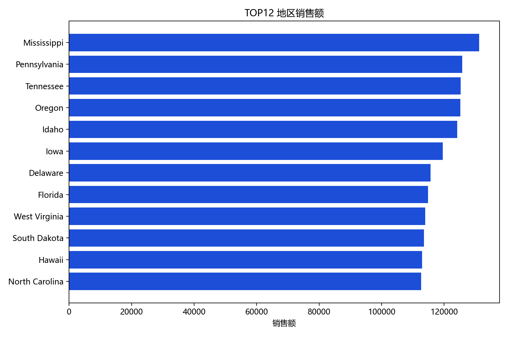

# 电商用户行为与销售数据分析报告

## 一、数据来源

本项目已替换为 2024 年之后的数据集：Hugging Face 的 **millat/e-commerce-orders**。数据覆盖 **2024-04-20 至 2025-04-19**，共 10000 条订单，字段包含订单、客户、商品、品类、价格、数量、订单日期、发货日期、配送状态、支付方式、设备类型、营销渠道、地址和客户分层。

数据来源：https://huggingface.co/datasets/millat/e-commerce-orders

许可证：MIT。

重要说明：该数据集的数据卡明确标注为 synthetic dataset，也就是近年公开合成电商订单数据。它不是某家企业公开的真实流水，但字段完整、时间较新，适合用来展示电商分析作品集能力。

## 二、数据清洗

清洗过程中完成了以下处理：

- 统一订单日期和发货日期为标准日期时间格式。
- 检查订单号、客户 ID、商品 ID、品类、价格、数量、渠道、地址等关键字段缺失情况。
- 删除关键字段缺失记录，清洗后保留 10000 行。
- 按订单号识别并删除重复订单 0 行。
- 过滤价格小于等于 0、数量小于等于 0 的异常记录。
- 计算订单金额 `order_amount = price * quantity`。
- 计算发货间隔 `shipping_days = shipping_date - order_date`。
- 将英文品类、渠道和客户分层映射为中文展示字段。
- 从收货地址中提取州/地区字段，用于地区销售分析。
- 按客户历史订单顺序计算复购标记 `is_repeat_order`。

清洗后有效订单为 10000 行，覆盖 2713 位客户。

## 三、核心经营指标

- 总销售额：5,334,932.86 美元
- 总订单量：10,000 单
- 有效用户数：2,713 人
- 客单价：533.49 美元
- 复购率：79.14%
- 销售峰值月份：2025-03，销售额 476,589.29 美元

从整体看，订单覆盖完整 12 个月，适合做月度趋势和渠道对比。销售峰值月份为 2025-03，需要结合渠道投放、品类结构和客户分层继续拆解。

## 四、销售分析

### 1. 每月销售额趋势

月度销售额整体波动较平稳，说明样本没有极端大促峰值。若用于真实业务复盘，可以进一步叠加促销日历、广告预算和库存变化解释峰谷。

### 2. 不同品类销售贡献

销售贡献最高的品类是 **家居**，销售额为 921,394.85 美元，占比 17.27%。该品类应优先关注毛利、库存周转和渠道投放效率。

### 3. TOP 商品分析

销售额最高的商品是 **商品ID-995**，销售额为 7,048.14 美元，销量 18 件。TOP 商品适合做组合推荐、广告素材主推和复购提醒。

## 五、用户分析

### 1. 新老用户占比

新老用户结构可以帮助判断增长质量。若新用户占比高但复购不足，说明获客后沉淀弱；若老用户占比高但新客不足，则需要加大拉新渠道测试。

### 2. 用户复购率

当前复购率为 **79.14%**。复购率较高说明样本中客户重复下单明显，适合进一步做会员分层、复购券和自动化触达。

### 3. RFM 用户分层

高价值用户共 527 人，平均消费 4577.40 美元，平均购买 8.11 次。

高价值用户的特征是近期购买、频次高、累计消费高。建议优先配置会员权益、专属折扣、组合推荐和新品提前触达。

### 4. 高价值用户画像

高价值用户画像从地区、渠道和偏好品类三个维度输出在 `high_value_profile.csv` 中，可直接用于 Power BI 的画像页。

客户分层中销售额最高的是 **VIP**，销售额为 2,722,687.10 美元，客单价为 528.78 美元。

## 六、渠道与地区分析

### 1. 不同渠道转化效果

销售额最高的渠道是 **社交媒体**，销售额为 1,358,397.30 美元，占比 25.46%；人均订单数最高的渠道是 **自然流量**，人均订单数为 1.69。

### 2. 不同地区销售额和订单量

销售额最高地区是 **Mississippi**，销售额为 131,175.29 美元；在订单量不少于 20 单的地区中，销售额较低的地区之一是 **Wyoming**，销售额为 80,812.01 美元。

### 3. 表现差异较大的地区或渠道

渠道上，销售额第一和人均订单数第一可能不同，说明“规模”和“效率”要分开看。地区上，头部地区贡献明显高于尾部地区，后续可以结合物流时效、客户分层和品类偏好继续拆解。

## 七、业务建议

1. 对销售贡献最高的品类提高库存保障，并围绕 TOP 商品设计组合推荐。
2. 对高价值用户建立 RFM 运营名单，配置专属券、新品提前购和复购提醒。
3. 对高销售渠道继续拆解客单价和人均订单数，避免只按销售额分配预算。
4. 对人均订单数高但销售规模较小的渠道做预算小幅放大测试。
5. 对弱势地区先检查配送时效、品类偏好和渠道覆盖，再决定是否扩大投放。
6. Power BI 仪表盘建议按“经营总览、商品品类、用户分层、渠道地区”四页组织。

## 八、项目产出

- 清洗后数据：`data/processed/clean_orders.csv`
- 指标宽表：`data/processed/*.csv`
- matplotlib 图表：`reports/figures/*.png`
- Power BI 导入数据集：`reports/powerbi/powerbi_dashboard_dataset.xlsx`
- Power BI 搭建说明：`reports/powerbi/powerbi_dashboard_notes.md`
